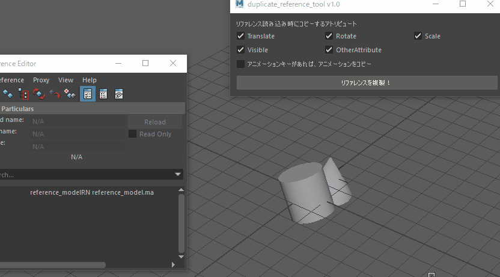
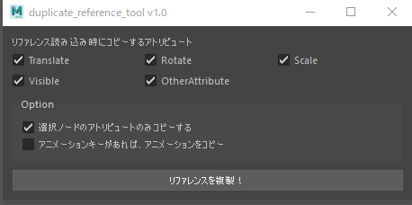

# duplicate_reference_tool ver1.0



duplicate_reference_tool は、現在選択しているノードのリファレンスを  
新しく読み込み、数値やアニメーションを読み込んだリファレンスにコピーしてくれるツールです。

## 使用方法

1. duplicate_reference フォルダを、 MyDocuments/maya/2018/scripts 下にコピーして下さい。
2. Maya の ScriptsEditor の Python タブに以下のコマンドをコピー・実行して下さい。

```python
import duplicate_reference
duplicate_reference.MainUI().show()
```



複製したいリファレンスのノードのうちいずれか 1 つを選択し、  
「リファレンスを複製！」ボタンを押します。  
実行すると、選択しているノードのリファレンスがもう 1 つ読み込まれ  
アトリビュートの情報がコピーされます。
